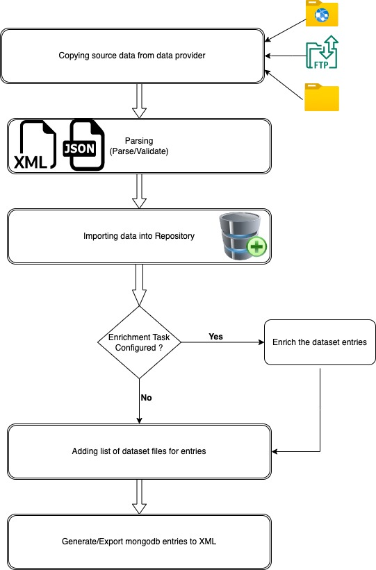

# ddi-omicsDI

## Overview
This repository consist of source code related to indexing-pipeline and RESTFUL webservices for [omicsdi.org](https://www.omicsdi.org/) application.

The RESTful API interface for the OmicsDI Web Services is available at
[https://www.omicsdi.org/ws/](https://www.omicsdi.org/ws/)
[Documentation](http://blog.omicsdi.org/post/introduction-api/)

OmicsDI Data Format Specification can be found [here](http://blog.omicsdi.org/post/omicsdi-spec/)
Test Commit
## Prerequisite
OpenJDK 17*
Spring 6 , SpringBoot 3
mongodb
Tomcat 10*
Maven 3

> **_NOTE:_**  We are replacing variable from maven profiles while building.All the environment specific fields should go in to maven settings xml

## Indexing pipeline
Indexing pipeline is core component of the OmicsDI application.This is complex workflow process which consist of many tasks.
High level task listed as below.
1) Copying data(can be XML/JSON) from data providers location
2) Parsing the data
3) Importing data into Repository(MongoDB in our case)
4) Enriching the data
5) Adding list of dataset files if any to each entry
6) Generating data from repository(MongoDB in our case)

## OmicsDI Web Services
Webservice component exposes many RESTEndpoint related to datasets and database.
Scientific communities using REST endpoint to fetch the Multiomics data for their study and feeding it collaborators for further research.

## Artifacts
1) indexing-pipeline : ddi-index-pipeline-version.jar
2) webservice : ddi-web-version.war

## Contact and Support
If you have any problems, suggestions or comments for our services please contact us via [Contact us](https://www.ebi.ac.uk/about/contact/support/index.php?query=omics-di)

